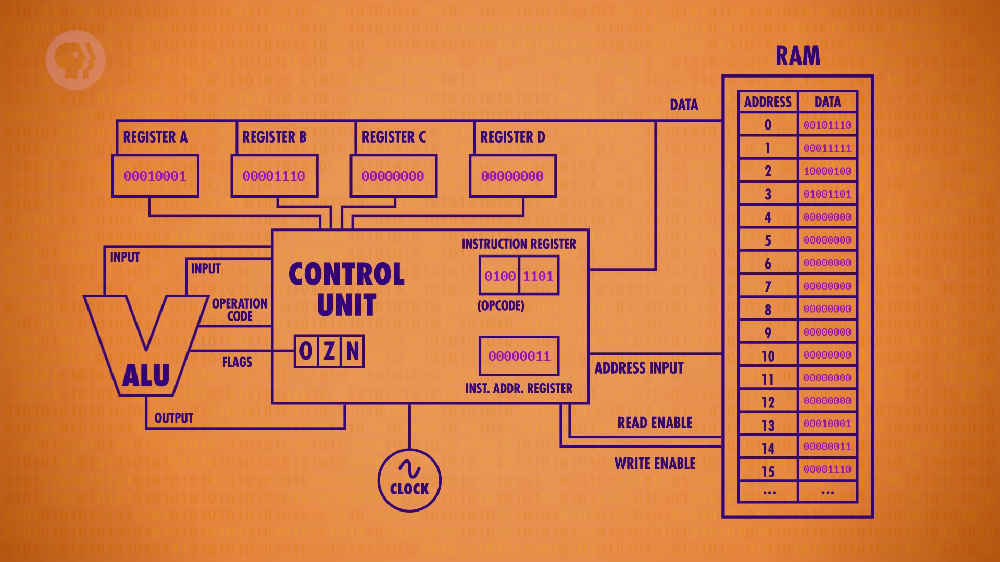

**The Central Processing Unit (CPU)**

Components in a CPU
- Arithmetic and Logic Unit (ALU) : does calculations and execute logical statements 
- Control Unit (CU) : contains the intstruction register that has the starting command of a program and the instruction address register that has the address of the starting command
                      of the program. 
- Registers : small amounts of high-speed temporary memories that stores information
- Internal clock: measures the number of cycles the CPU executes per second, it keeps the operations synchronised. 

                     
                      
               
