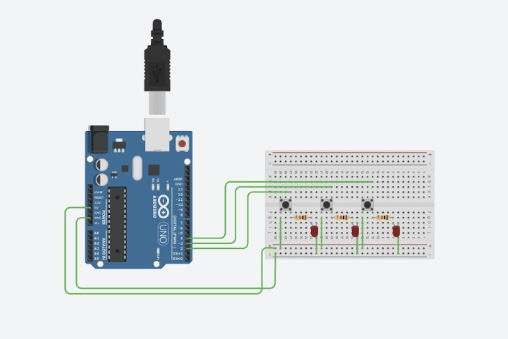

# Austomatic 3-bit LED Binary Counter #


```.C
// C code

//creating variables for each LED
int pin2 = 2;
int pin3 = 3;
int pin4 = 4;
int waitTime = 1000;

void setup()
{
pinMode(pin2, OUTPUT);
pinMode(pin3, OUTPUT);
pinMode(pin4, OUTPUT);
}

void loop()
{
digitalWrite(pin2, LOW);
digitalWrite(pin3, LOW);
digitalWrite(pin4, LOW);  
delay(waitTime);
  
digitalWrite(pin2, LOW);
digitalWrite(pin3, LOW);
digitalWrite(pin4, HIGH);  
delay(waitTime);
  
digitalWrite(pin2, LOW);
digitalWrite(pin3, HIGH);
digitalWrite(pin4, LOW); 
delay(waitTime);
      
digitalWrite(pin2, LOW);
digitalWrite(pin3, HIGH);
digitalWrite(pin4, HIGH); 
delay(waitTime);

digitalWrite(pin2, HIGH);
digitalWrite(pin3, LOW);
digitalWrite(pin4, LOW); 
delay(waitTime);

digitalWrite(pin2, HIGH);
digitalWrite(pin3, LOW);
digitalWrite(pin4, HIGH); 
delay(waitTime);

digitalWrite(pin2, HIGH);
digitalWrite(pin3, HIGH);
digitalWrite(pin4, LOW);  
delay(waitTime);

digitalWrite(pin2, HIGH);
digitalWrite(pin3, HIGH);
digitalWrite(pin4, HIGH);;
delay(waitTime);
}

```

# 3-bit LED Binary counter with buttons #



```.C
 
//variables for the LEDs
int pin2 = 2;
int pin3 = 3;
int pin4 = 4;
//variables for the buttons
int button2 = 2;
int button3 = 3;
int button4 = 4;
//variables for state of button
int buttonState2 = 0;
int buttonState3 = 0;
int buttonState4 = 0;

void setup()
{
	pinMode(button2, INPUT);
  	pinMode(button3, INPUT);
  	pinMode(button4, INPUT);
    pinMode(pin2, OUTPUT);
  	pinMode(pin3, OUTPUT);
  	pinMode(pin4, OUTPUT);
}

void loop()
{	
  //check if button is pushed or not
  	buttonState2 = digitalRead(button2);
    if (buttonState2 == HIGH)
    {
    	digitalWrite(pin2, HIGH);
  	} 
  	else{
    	digitalWrite(pin2, LOW);
  	}
  
  	buttonState3 = digitalRead(button3);
    if (buttonState3 == HIGH)
    {
    	digitalWrite(pin3, HIGH);
  	} 
  	else{
    	digitalWrite(pin3, LOW);
  	}
  
  	buttonState4 = digitalRead(button4);
    if (buttonState4 == HIGH)
    {
    	digitalWrite(pin4, HIGH);
  	} 
  	else{
    	digitalWrite(pin4, LOW);
  	}
    
}
