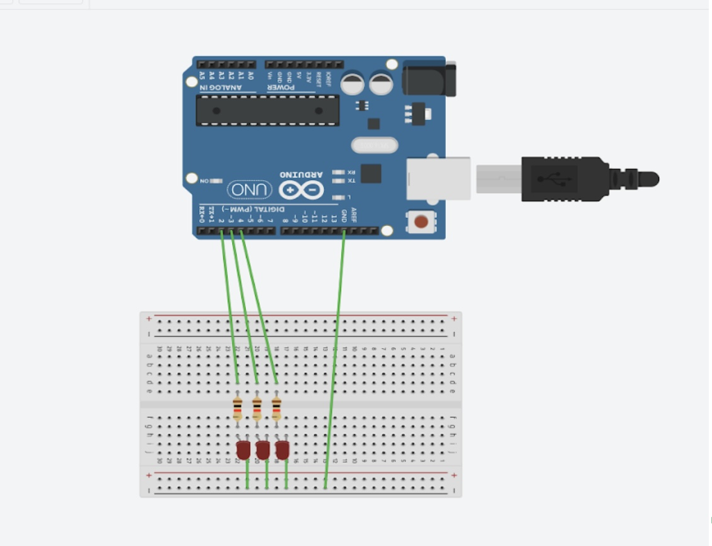

**3-bit LED Binary Counter**





```.C
// C code

//creating variables for each LED
int pin2 = 2;
int pin3 = 3;
int pin4 = 4;
int waitTime = 1000;

void setup()
{
pinMode(pin2, OUTPUT);
pinMode(pin3, OUTPUT);
pinMode(pin4, OUTPUT);
}

void loop()
{
digitalWrite(pin2, LOW);
digitalWrite(pin3, LOW);
digitalWrite(pin4, LOW);  
delay(waitTime);
  
digitalWrite(pin2, LOW);
digitalWrite(pin3, LOW);
digitalWrite(pin4, HIGH);  
delay(waitTime);
  
digitalWrite(pin2, LOW);
digitalWrite(pin3, HIGH);
digitalWrite(pin4, LOW); 
delay(waitTime);
      
digitalWrite(pin2, LOW);
digitalWrite(pin3, HIGH);
digitalWrite(pin4, HIGH); 
delay(waitTime);

digitalWrite(pin2, HIGH);
digitalWrite(pin3, LOW);
digitalWrite(pin4, LOW); 
delay(waitTime);

digitalWrite(pin2, HIGH);
digitalWrite(pin3, LOW);
digitalWrite(pin4, HIGH); 
delay(waitTime);

digitalWrite(pin2, HIGH);
digitalWrite(pin3, HIGH);
digitalWrite(pin4, LOW);  
delay(waitTime);

digitalWrite(pin2, HIGH);
digitalWrite(pin3, HIGH);
digitalWrite(pin4, HIGH);;
delay(waitTime);
}
