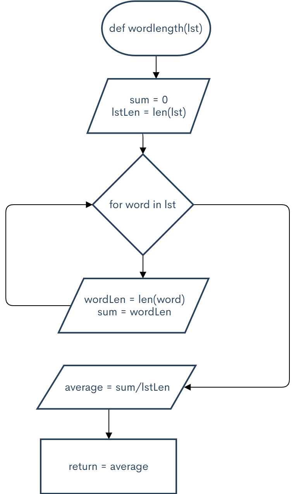

```.py
def wordlength(lst):
    sum = 0
    lstLen = len(lst)
    for word in lst:
        wordLen = len(word)
        sum += wordLen
    average = sum/lstLen
    return average


output = wordlength(["home", "car", "travel", "beach"])
print(output)

output = wordlength(["cat", "dog", "rabbit", "hamster", "horse"])
print(output)

C:\Users\ASUS\PycharmProjects\pythonProject2\venv\Scripts\python.exe C:/Users/ASUS/PycharmProjects/pythonProject2/main.py
4.5
4.8

Process finished with exit code 0
```

