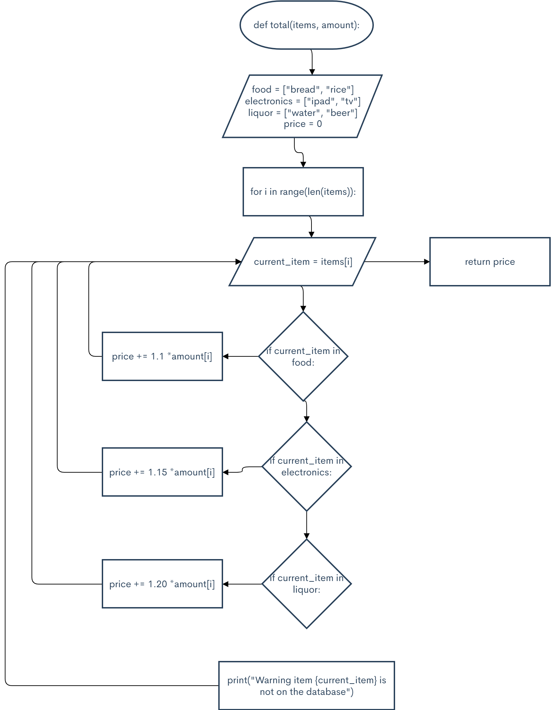

```.py

def total(items, amount):
    food = ["bread", "rice"]
    electronics = ["ipad", "tv"]
    liquor = ["water", "beer"]

    price = 0
    for i in range(len(items)):
        current_item = items[i]
        if current_item in food:
            price += 1.1 * amount[i]
        elif current_item in electronics:
            price += 1.15 * amount[i]
        elif current_item in liquor:
            price += 1.20 * amount[i]
        else:
            print(f"Warning item {current_item} is not on the database")

    return price


items_ordered = ["bread", "beer", "ipad"]
amount_ordered = [300, 800, 30000]
total_pay = total(items=items_ordered, amount=amount_ordered)
print(f"Pay {total_pay}")

C:\Users\ASUS\PycharmProjects\pythonProject2\venv\Scripts\python.exe C:/Users/ASUS/PycharmProjects/pythonProject2/main.py
Pay 35790.0

Process finished with exit code 0
