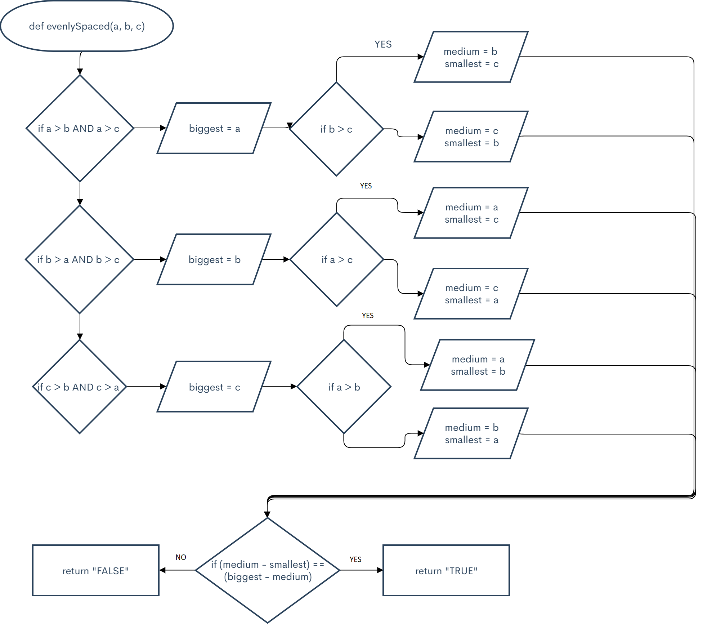

```.py

def evenlySpaced(a, b, c):

    if a > b and a > c:
        biggest = a
        if b > c:
            medium = b
            smallest = c
        elif c > b:
            medium = c
            smallest = b
    if b > a and b > c:
        biggest = b
        if a > c:
            medium = a
            smallest = c
        elif c > b:
            medium = c
            smallest = a
    if c > b and c > a:
        biggest = c
        if a > b:
            medium = a
            smallest = b
        elif c > b:
            medium = b
            smallest = a

    if (medium - smallest) == (biggest - medium):
        return "TRUE"
    else:
        return "FALSE"


output = evenlySpaced(2, 4, 6)
print(output)

output = evenlySpaced(4, 6, 2)
print(output)

output = evenlySpaced(4, 6, 3)
print(output)

C:\Users\ASUS\PycharmProjects\pythonProject2\venv\Scripts\python.exe C:/Users/ASUS/PycharmProjects/pythonProject2/main.py
TRUE
TRUE
FALSE

Process finished with exit code 0
