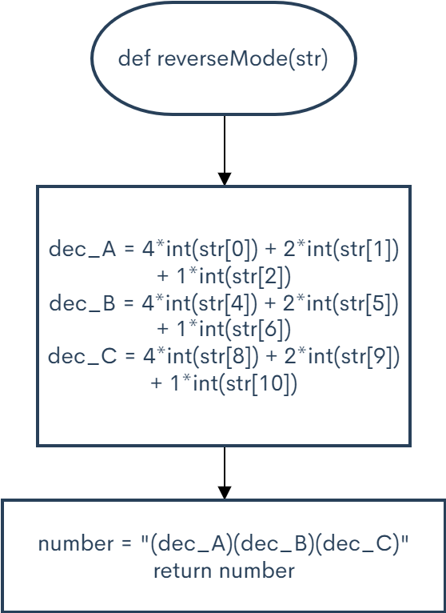

```.py
def reverseMode(str):
    dec_A = 4 * int(str[0]) + 2 * int(str[1]) + 1 * int(str[2])
    dec_B = 4 * int(str[4]) + 2 * int(str[5]) + 1 * int(str[6])
    dec_C = 4 * int(str[8]) + 2 * int(str[9]) + 1 * int(str[10])

    number = f"{dec_A}{dec_B}{dec_C}"
    return number

output = reverseMode("100!000!111")
print(output)

output = reverseMode("000!001!000")
print(output)

output = reverseMode("011!010!001")
print(output)

output = reverseMode("000!000!000")
print(output)

C:\Users\ASUS\PycharmProjects\pythonProject2\venv\Scripts\python.exe C:/Users/ASUS/PycharmProjects/pythonProject2/main.py
407
010
321
000

Process finished with exit code 0
