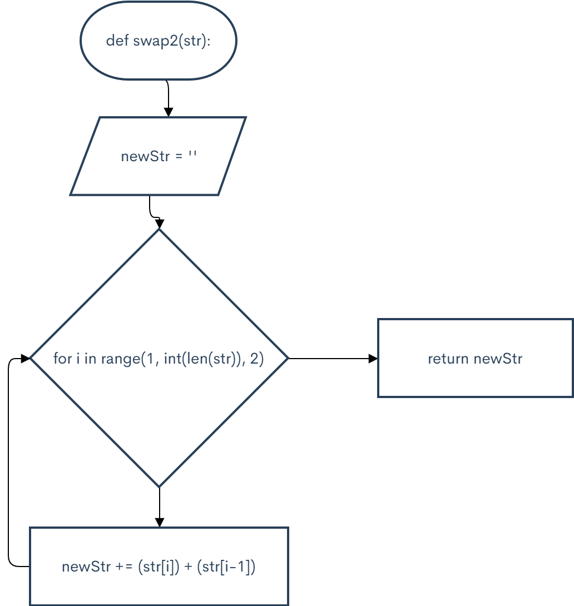

```.py
def swap2(str):
    newStr = ""
    for i in range(1, int(len(str)), 2):
        newStr += (str[i]) + (str[i-1])

    return newStr

output = swap2("01ABxy")
print(output)

C:\Users\ASUS\PycharmProjects\pythonProject2\venv\Scripts\python.exe C:/Users/ASUS/PycharmProjects/pythonProject2/main.py
10BAyx

Process finished with exit code 0
