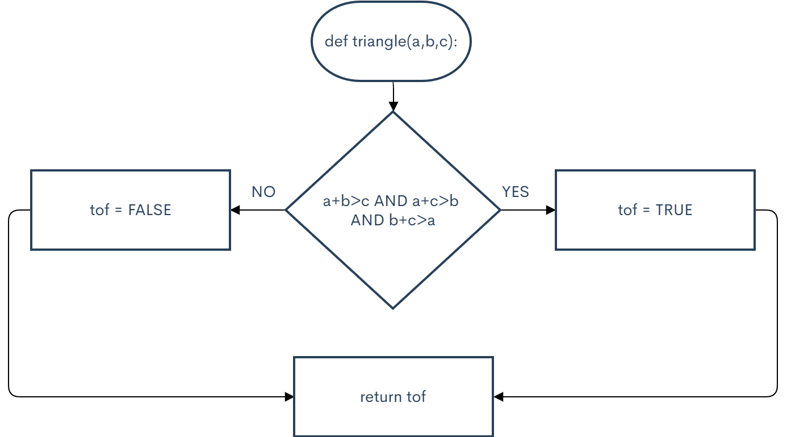

```.py

def triangle(a, b, c):
    if a+b>c and a+c>b and b+c>a:
        tof = "TRUE"
    else:
        tof = "FALSE"

    return tof

output = triangle(1,1,2)
print(output)

output = triangle(5,6,3)
print(output)

output = triangle(1,2,9)
print(output)

C:\Users\ASUS\PycharmProjects\pythonProject2\venv\Scripts\python.exe C:/Users/ASUS/PycharmProjects/pythonProject2/main.py
FALSE
TRUE
FALSE

Process finished with exit code 0
